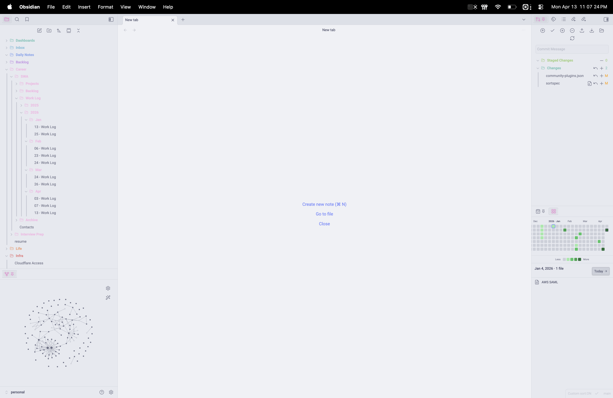
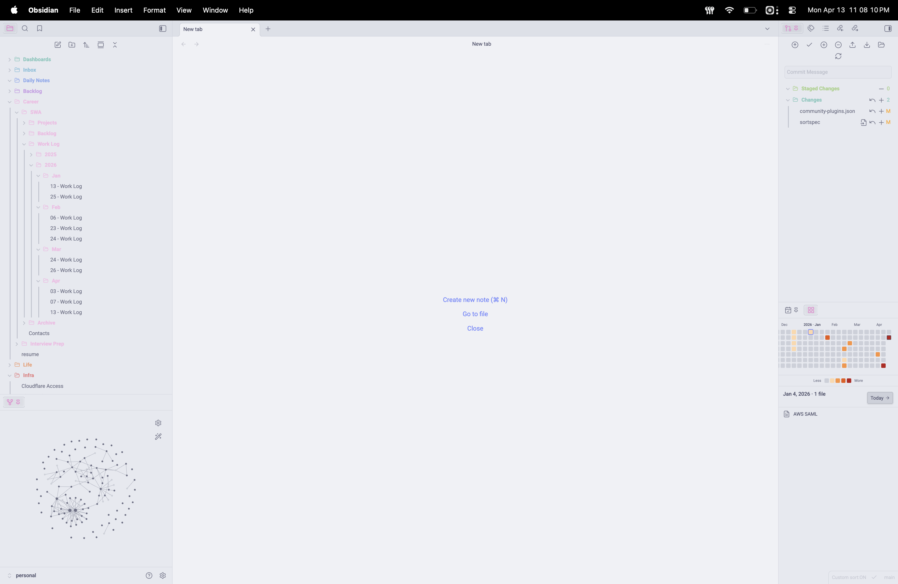
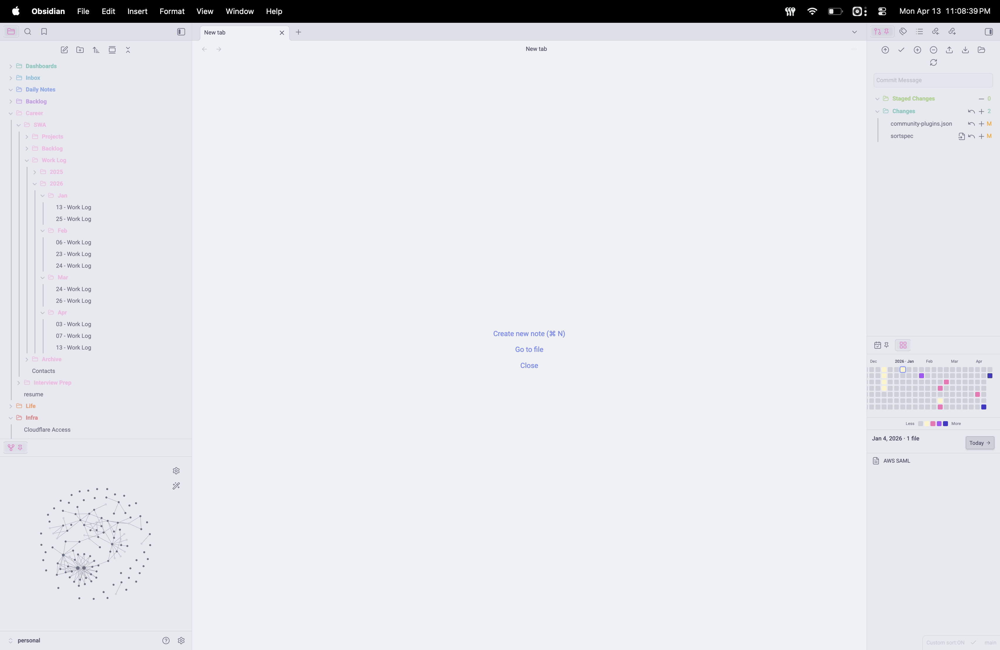
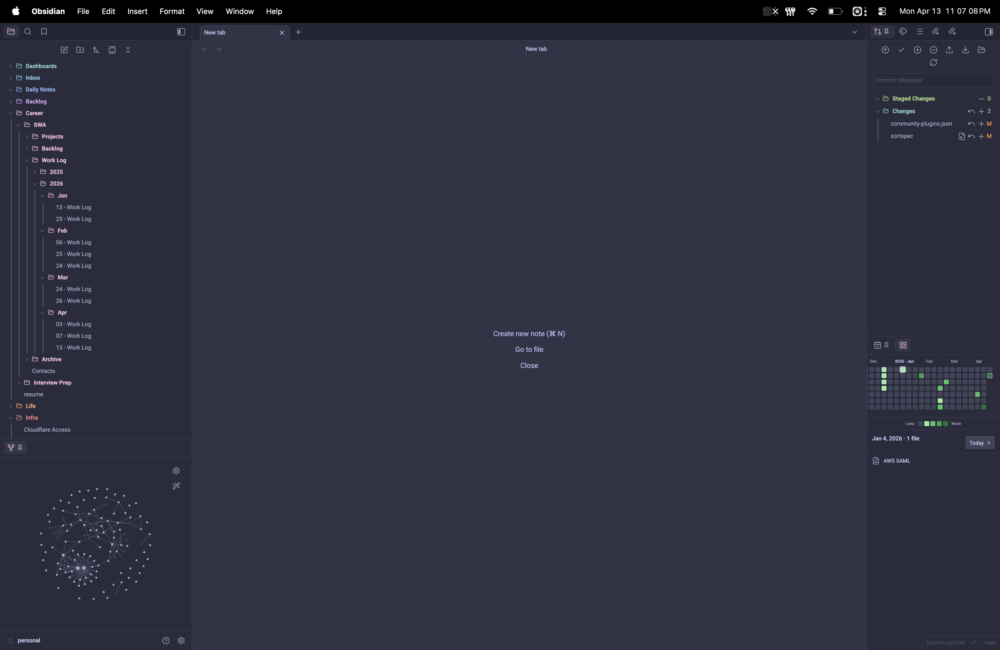
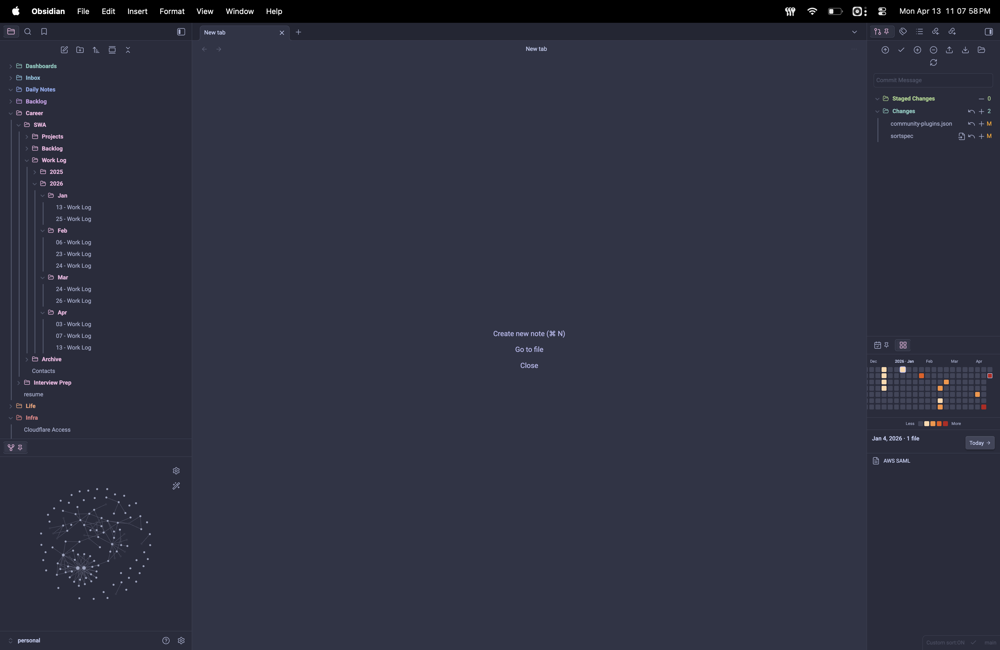
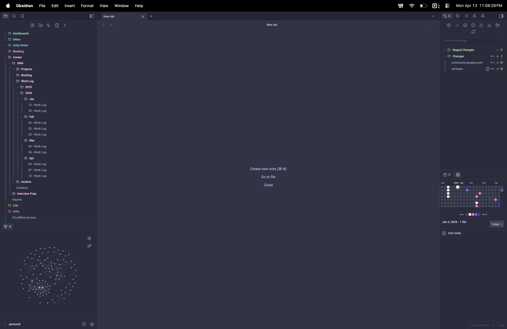

# Vault Pulse

A GitHub-style activity heatmap for Obsidian. Renders a 53×7 grid of the last 365 days in a sidebar pane, so you can see your writing cadence at a glance — then click any day to see the exact files you touched.

| Green | Heat | Sunset |
|:-----:|:----:|:------:|
|  |  |  |
|  |  |  |

_Three of the built-in palettes, in light and dark themes._ Auto (theme accent) and Custom (any hex) round out the five options.

## Features

- **Sidebar pane** — lives in the right sidebar, collapses like any other panel.
- **365-day heatmap** — 53 columns × 7 rows, today anchored bottom-right, today's cell always outlined.
- **Quantile-based colors** — buckets adapt to your vault size; no hardcoded thresholds.
- **Five color palettes** — Auto (theme accent), Green (GitHub-style), **Heat** (orange → red), **Sunset** (gold → indigo), or Custom hex.
- **Detail panel** — click any day and the panel below lists the files for that day, each clickable, each ⌘-hover previewable.
- **Streak indicator** — selected-day streak shows in the header when you're on a run of consecutive active days.
- **Jump to today** — command palette entry, plus a "Today →" button in the detail header when you've scrolled away.
- **Keyboard navigation** — Tab into the grid, then ←/→ = ±week, ↑/↓ = ±day; the detail panel updates as you move.
- **Apple-style scroll bounce** — mass-spring-damper physics tuned to SwiftUI's default feel (`response=0.55s`, `dampingFraction=0.825`).
- **Theme-aware** — colors follow your Obsidian theme and re-render on theme switch.
- **Auto-updates** — edits, creates, deletes, and renames re-render within ~200ms (debounced).
- **Mobile-compatible** — no Node / Electron APIs; `isDesktopOnly: false`.
- **Reduced-motion friendly** — every animation and the scroll bounce disable when the OS has Reduce Motion enabled.

## Install

### From the community plugin store

*Coming soon.* Once accepted you'll be able to install from **Settings → Community plugins → Browse → search "Vault Pulse"**.

### Manual install

1. Download `main.js`, `manifest.json`, and `styles.css` from the latest [release](https://github.com/stefmf/vault-pulse/releases).
2. Copy them into `<YourVault>/.obsidian/plugins/vault-pulse/` (create the folder if it doesn't exist).
3. In Obsidian: **Settings → Community plugins**, enable **Vault Pulse**.

### Build from source

```bash
git clone https://github.com/stefmf/vault-pulse.git
cd vault-pulse
npm install
npm run build
```

Copy `main.js`, `manifest.json`, and `styles.css` into `<YourVault>/.obsidian/plugins/vault-pulse/`, or use `npm run seed` (see Development) which sets up a throwaway vault with the plugin pre-installed.

## Usage

Open the heatmap via the **grid** ribbon icon (left sidebar) or the command palette entry **Vault Pulse: Open heatmap**.

- **Hover** a cell → tooltip: `Mon DD · N files`.
- **Click** a cell → detail panel shows the file list for that day; click a file row to open it.
- **⌘-hover** (macOS) / **Ctrl-hover** (Windows/Linux) a file row → Obsidian's native note preview popover.
- **Tab** into the grid, then **arrow keys** to move: ←/→ = prev/next week, ↑/↓ = prev/next day.
- **Esc** or **click outside** the pane closes nothing — the detail panel is always visible.
- Run **Vault Pulse: Jump to today** (⌘P) or click the **Today →** button in the detail header to scroll back and re-select today.

## Settings

| Setting | Options | Notes |
|---------|---------|-------|
| **Activity source** | Combined / Modified / Created | Default: Combined. A file counts for a day if **either** created OR updated matches that day. |
| **Color palette** | Auto · Green · Heat · Sunset · Custom hex | Auto follows `--interactive-accent`. Named palettes use discrete hex values tuned for both light and dark themes. |
| **Custom hex color** | `#RRGGBB` | Only visible when palette is "Custom". |
| **Week starts on** | Sunday / Monday | Default: Sunday (matches GitHub). |

### Frontmatter dates

Vault Pulse reads `created` and `updated` from each note's frontmatter when present. Supported formats: ISO 8601 (`2026-04-13`, `2026-04-13T12:34:56`), SQL (`2026-04-13 12:34:56`), JS Date objects, and Unix millisecond epochs. Missing frontmatter falls back to the file's filesystem stat (`ctime` / `mtime`).

## How the colors work

Activity levels use quantile bucketing over the **non-zero days** in the 365-day window:

| Level | Condition |
|-------|-----------|
| 0 | count = 0 (theme border color) |
| 1 | `count ≤ p25` |
| 2 | `p25 < count ≤ p50` |
| 3 | `p50 < count ≤ p75` |
| 4 | `count > p75` |

This adapts automatically: a light vault with ~1 note/day and a heavy vault with dozens/day both end up with meaningful bucketing. For the Auto and Custom palettes the colors are computed as alpha-blends of your base color, so empty days show through the theme background. For Green, Heat, and Sunset, the four levels are pre-tuned discrete hex values.

## Development

```bash
npm install
npm run dev        # esbuild watch mode
npm test           # vitest suite (51 tests — pure function coverage)
npm run seed       # seeds ./test-vault/ with 50 fake notes across ~90 days
npm run sync       # copies main.js/manifest.json/styles.css into test-vault plugin folder
npm run build      # type-check + production bundle
```

### Test vault

`npm run seed` generates `./test-vault/` with frontmatter-dated notes, creates `.obsidian/plugins/vault-pulse/`, and copies the built files in. Open that folder as a vault in Obsidian to iterate. Re-run `npm run build && npm run sync` after code changes and reload Obsidian (⌘R) to pick them up.

### Project layout

```
src/
  main.ts            Plugin lifecycle, registerView, ribbon, commands, hover-link source
  view.ts            ItemView subclass, refresh orchestration, roving tabindex
  renderer.ts        Pure DOM build (CSS grid of divs, legend, month labels w/ year transition)
  detailPanel.ts     Detail panel (date header, streak, Today button, file rows)
  data.ts            Vault scan → Map<isoDate, TFile[]>
  dateUtils.ts       Luxon date math (grid start, week/col indices, month labels)
  colorUtils.ts      Quantile buckets + palette dispatch (discrete + alpha-blend)
  interactions.ts    Hover tooltip, click selection, arrow-key navigation
  elasticScroll.ts   Apple-style mass-spring-damper scroll bounce
  settings.ts        Settings interface, defaults, PluginSettingTab
  types.ts           Shared interfaces
tests/               vitest suites for the pure modules
scripts/
  seed-vault.mjs     Seeds test-vault/ with 50 notes + installs built plugin
  sync-plugin.mjs    Copies built plugin files into test-vault (for iteration)
```

See [`AGENTS.md`](AGENTS.md) for contributor conventions.

## License

[MIT](LICENSE) © 2026 Stephen Monclova
